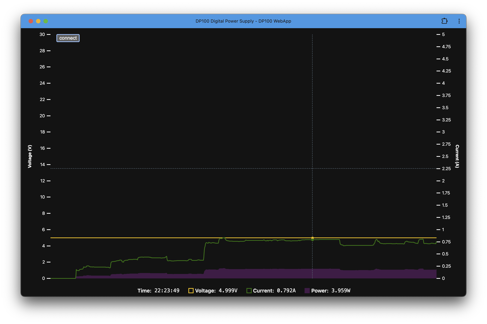

# DP100 WebApp

A browser interface for the DP100 digital power supply by Alientek.

## Features

- Connect to the DP100 using your browser (no installation required).
- Histogram of the voltage and current levels.

## Usage

Grap you DP100 power supply and connect the DP100 via it's USB-A port to your computer.

Now, visit [DP100 WebApp](https://johannes.maron.family/DP100-WebApp/) and you're good to go.

_Note, not all browsers support WebHID yet and on Linux you might need to enable write mode first,
see [Contributing Guide](CONTRIBUTING.md)._

## Development & Contributing

We welcome contributions to this project. Please read the [Contributing Guidelines](CONTRIBUTING.md) for more information.

## Credits

Special thanks for [@scottbez1](https://github.com/scottbez1) for inspiring this project and being an overall camp.
